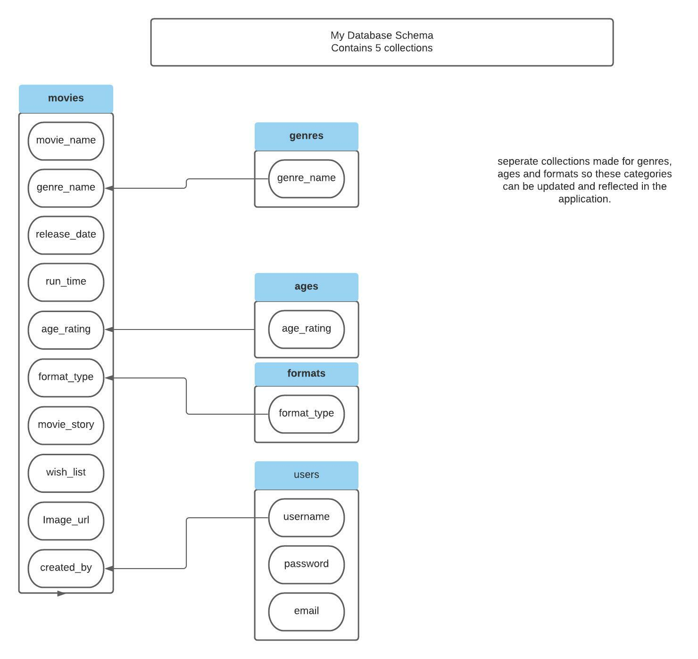

# My Movie Catalog

### [Link to Live Heroku hosted website](https://ms3-my-movie-catalog.herokuapp.com/)

## <u>Screenshots</u>

 

## A Python and Data Centric Development Project

- This is my Third Milestone Project with Code Institute. Its purpose is to build a full stack site that allows users to manage a common dataset. I have chosen to make a Movie library that users can add and edit Movies to the database

---
## <u>Table of Contents</u>
- [Screenshots](#screenshots)
- [UX](#ux)
    - [User goals](#user-goals)
    - [User stories](#user-stories)
    - [Structure of the website](#structure-of-the-website)
- [Features](#features)
- [Technology Used](#technology-used)
- [Testing](#testing)
    - [Functionality testing](#functionality-testing)
    - [Compatibility testing](#compatibility-testing)
    - [Code Validation](#code-validation)
    - [User stories testing](#user-stories-testing)
    - [Issues found during site development](#issues-found-during-site-development)
    - [Performance testing](#performance-testing)
- [Deployment](#deployment)
- [Credits](#credits)
 
 ---
## <u>UX</u>

 ### User Goals
  
 #### New user Goals

- To create an account that enable the user to login and to logout when finished.

- User registration allows further access to the database. Such as Edit and delete movies.

- To show A user profile that matches the registration details.

- To see a list of movies stored on the database and relevant information about the movie.

- To search for movies by name or movie description

- To add new movies to database

- To edit movies on the database

- To delete Movies on the database
 

#### Returning User Goals

- To view, edit and delete movies on the database 

- To search for movies by name or movie description

### User Stories

#### As A New user.

- I want to be able to create a user account that allows further access

- I want to be able to log in and log out having a unique user account and password known only to me. 

- I want to see Information about movies that are on the database
 
- I want to be able to add and edit movies on the database which records my user details within the database

- I want to be able to delete movies from the database

- I want to be able to tag a movie that I would like and that shows in a seperate search.

#### As A returning user.

- I want to be able to log in and log out using a unique user account and password created by myself

- I want to edit and add movies and have that action attributed to my account.

- I want to be able to delete movies from the database

- I want to be able to search the database for movies

- I want to be able to flag movies that I would like to have.

#### Website Owner Goals

- To create a website that users can access a movie catalog of Movies that they own or that they would like to own or watch.

- Each user to have a unique login and secure password only known to them.

- abilty for users to log out of the account.

- Tasks such as editing and adding movies should display the users details.

- deleting movies should require a confirmationary request to prevent accidental deletion.

- users should be able to search for movies, this to be by movie name, description, genre type or by 'wish list'

- A function that allows users to flag a movie that they would like to watch/own.  A Wish list.

- A Profile section for the user to verify there details.

### Structure of the website

- I want the website to be easily accessible, simple to navigate and user friendly. It must also be displayed 
  for various devices (desktop ,Tablet, Mobile Phone) whilst mantaiining a great user experience . Links within the website taking me to other features

#### Database Schema

---
## <u>Features</u>

- This website will consist of of a landing page that has view only access to the displayed movie tiles And a limited navigation bar with the option to login or register.. 

 The search and genre select button shoule be accesible for all. Once a user is registered and logged in, other feature becaome avaialbe. Further Navigation links are present for 'Profile' and 'Add Movie'. In addition the login button is replaced with a log out button.  Ae search bar to search by movie name or movie description present in addition to Select movies by genre. The Film tiles will also contain an edit button that allows editing of the movi details, adding and editing movies will attribute to the user details. Users can also delete the movie within the edit function.  Pressing the button will require a confirmation click to delete to help prevent accidental deletions. 

- A basic pofile page confirming the username and associated email address which is required upon registration. 

- Add movie section that reveals form categorys for the user to complete which are relevant to the movie. The section of Genre, format and age rating are all dropdown selection boxes, however the options from these are gathered from the the database in linked librarys. All options are self explainitory. The URL option at the bottom is pre filled with an example HTML.  IF user has no film specific URL this can be left as is and submitted.  A wishlist toggle button at the bottom that adds a further field for displaying movies the users may want.  Buttons present that cancels the form (redirect back to home screen), clears the form and Adds the movie.

- Log out tab.   Clears the users session cookie 

- On admin login a final navigation tab available of Categories. This allows the admin to create, edit or delete genre categories. 

#### Fonts

- The main font used is 'DM sans' with back-up of  sans-serif  obtained from [Google-fonts](www.fonts.google.com)

#### Images

- URL links to images displayed on the Movie tiles.

- Movie 'clapper' image found on google search.  No obvious credit source stated.

#### Navbar and footer

- low profile navigation bar and footer

- Navbar located at top with brand name to the left and a responsive menu on the right. For Mobile and tablet this is 
  an expanding 'Hamburger' menu opening below the icon to reveal  menus of Home and Login/register.

    - when logged in as User additional options of Profile and Add movie present.

    - when logged in as Admin, additional option of Categories revealed.

    - Logging in Removes login/register and replaces with logout.
    
- Footer is located at the bottom and displays copyright label.

#### Hero Image

- Fixed image of a film reel slide.

#### Flash Message display area. 

- Below the footer, a flash message will appear for the following actions.

    - Registering A user account.
    - Incorrect password/username
    - add/edit/delete Movie
    - add/edit/delete Genre

#### Main Movie search section

#### Profile Page

-  Basic profile page displaying the username and email address of the user.

### Existing Features

- unique username creation

- password validation on registration form. 

- movie cards that are stored on a database and accessible to the user. 

- ability to add, edit and delete Movie details. 

#### Future Features 

- Deleted movies to remain on database but removed from users view. Admin section to re-instated deleted movies or perma delete.

- Link in movie cards that can direct a user to a purchase of that movie, potential to earn money via referals.

- registration to capture more details from the user, eg, name, address etc.  This will be displayed on the profile page. In addition the profile page
  will have options for the user to update there infomation and/or delete the account.

- Ability for admin to remove users ability to add/edit or delete movies based only on user details. 

- Various levels of users which opens up more access.  At present only 2 levels. User or admin.  example could be only allowed to edit/delete there own movies. 
  
- Movie rating.

[Back to Table of contents](#table-of-contents)

---
## <u>Technology Used</u>

* [MongoDB](https://www.mongodb.com/)

* [Flask](https://flask.palletsprojects.com)
  
  - Web framework written in Python

* [Heroku](https://www.heroku.com/)

  - cloud platform for project deployment

* [Python](https://www.python.org/)

  - programming language. Utilizing the following tools:
    - Pymongo - used to link python with mongo DB
    - Werkzeug - For password hash and username

* [HTML5](https://en.wikipedia.org/wiki/HTML5)

  - Main Programming language

* [CSS](https://en.wikipedia.org/wiki/CSS) 

  - Style sheet language

* [JS](https://www.javascript.com/)

  - Used to create interactive functionality

* [Jquery](https://jquery.com/)

  - JavaScript library

* [Google Fonts:](https://fonts.google.com/)

  - Used to import custom fonts

* [Google Icons:](https://fonts.google.com/icons) 

  - Used to import icons

* [GitHub:](https://www.github.com.com)

  - Used to store projects created in gitpod. 

* [Gitpod:](https://www.gitpod.io.com)

   - Used to develop the project, including version control (using commits and comments.)

* [MaterializeCSS:](https://materializecss.com)

  - Used to assist in a responsive site with a mobile first approach. 

* [windows Photo editor](https://www.microsoft.com/en-us/p/photo-editor-for-windows-10/9mzwk7vt6b3g?activetab=pivot:overviewtab)

   - Basic photo editor

[Back to Table of contents](#table-of-contents)

---
## <u>Testing</u>

- Navbar
    - Clicking on the menu links takes you to the desired section.
    - Navbar brand link disabled
    - Hamburger menu appears at relevant view width and drop down menu works correctly

### Functionality testing

- chrome Browser used to run Gitpod and developer tools used to test , solve problems, style and responsiveness.
Chrome developer tools used to check compatibility during project and to check on consistency.

- Mozilla Dev tools used to test in addition to chrome dev tools.    

- No issues detected.

### Compatibility testing

- I have tested the website on the virtual devices (including landscape orientation) contained with the Dev Tools of Mozilla and Chrome with no 
issues seen on either. A wide range of screen sizes tested from mobile, tablet and desktop.

- I have tested compatibility on the heroku published website of the project on a 1920 x 1080 monitor, a galaxy s7 
and a Motorola  one+ mobile phone with no issues noted

- The website was submitted for peer review and no Issues were recorded by thous viewing.

### Code Validation
-  https://jigsaw.w3.org/css-validator/   

    - This document validates as CSS level 3 + null 

-  https://validator.w3.org/

    - all pages checked with no issues. 

-  https://wave.webaim.org/ - A web accessibility checker

    - Errors present in the default JS code for googlemaps that i cannot change. No errors relating to my unique code.

-  https://pep8online.com - app.py file checked - all right

### User stories testing

### Returning User Stories Testing

### Issues found during development

-  For loop issue.  Named the collection as genre (should of used plural), should have been genres as this creates
uniformity in 'forloop'  Forced me to write 

- Hero image failed validation.  This was due to the the image being directly in the HTML code and also using a Jinja expression to locate the file. 
  A simpler method was placing in the css file as 'background' and linking via a class. This warning was also similar for the default image of the onerror when displaying a image of the movie. 

  

### Performance testing

  - I have used [Lighthouse](https://developers.google.com/web/tools/lighthouse/) for the performance testing.
      

#### Desktop performance

#### Mobile Performance

[Back to Table of contents](#table-of-contents)

---
## <u>Deployment</u>

My project was developed on Gitpod with regular commits during development to Github via pushing. This also ensured against data loss.

To deploy my project in github I took the following steps.

- Login and Select the repository in github. ([ms2-surfs-up-ireland](https://github.com/VinceNolan999/ms2-surfs-up-ireland))
- Click on the settings button
- locate the Github pages section.
- Select 'save' and then refresh or an auto refresh
- Displayed at top of Github pages - Your site is published at https://vincenolan999.github.io/ms2-surfs-up-ireland/

To Deploy locally.
- Login and Select the repository in github. [ms2-surfs-up-ireland](https://github.com/VinceNolan999/ms2-surfs-up-ireland)
- Go-to 'code' and  'download zip'
- Locate the ZIP file, unpack and deploy into your local environment.

Alternatively you can [Clone](https://docs.github.com/en/free-pro-team@latest/github/creating-cloning-and-archiving-repositories/cloning-a-repository)
or [Fork](https://docs.github.com/en/free-pro-team@latest/github/getting-started-with-github/fork-a-repo)
this repository ([ms2-surfs-up-ireland](https://github.com/VinceNolan999/ms2-surfs-up-ireland)) into your github account.

[Back to Table of contents](#table-of-contents)

---
## <u>Credits</u>

### knowledge base and design ideas

* [Slack](https://slack.com/)

* [w3schools.com](https://www.w3schools.com)

* [codeinstitute](https://codeinstitute.net/) - Ongoing course progression

### Code Templates

- Various [Materilize](https://materializecss.com) templates used.

- CI code validation for forms where required field is needed.  This was provided in the mini project 'task manager'

### Content

### Media

- Images are dynamically loaded via a Url and added by a user.                                    

### Acknowledgments

- Code Institute Pre-loaded github tools

[Back to Table of contents](#table-of-contents)
