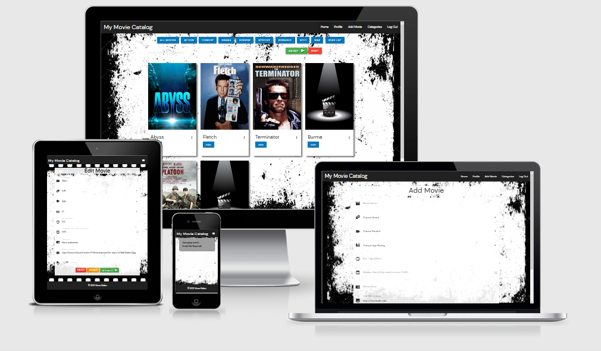
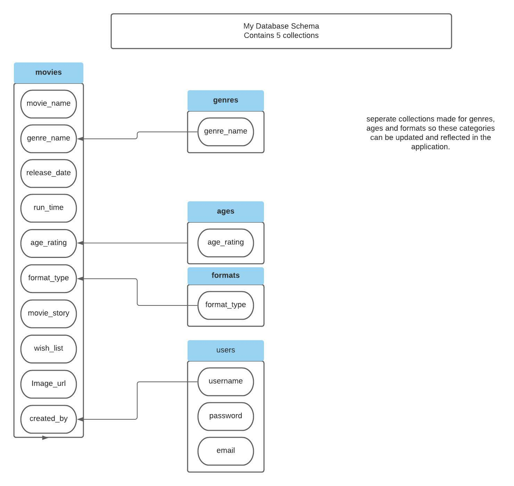
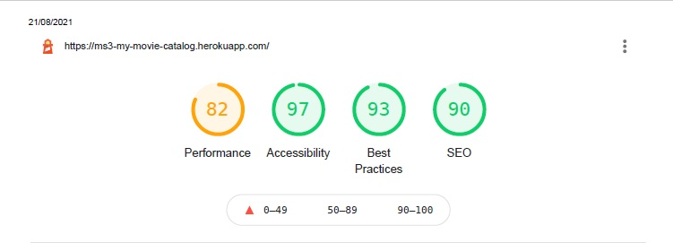
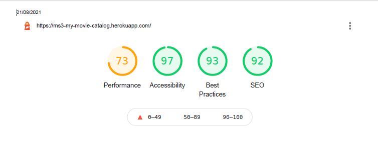

# My Movie Catalog

### [Link to Live Heroku hosted website](https://ms3-my-movie-catalog.herokuapp.com/)

## <u>Screenshots</u>

 

## A Python and Data Centric Development Project

- This is my Third Milestone Project with Code Institute. Its purpose is to build a full stack site that allows users to manage a common dataset. I have chosen to make a Movie library that users can add and edit Movies to the database

---
## <u>Table of Contents</u>
- [Screenshots](#screenshots)
- [UX](#UX)
    - [User goals](#user-goals)
    - [User stories](#user-stories)
    - [Structure of the website](#structure-of-the-website)
- [Features](#features)
- [Technology Used](#technology-used)
- [Testing](#testing)
    - [Functionality testing](#functionality-testing)
    - [Compatibility testing](#compatibility-testing)
    - [Code Validation](#code-validation)
    - [User stories testing](#user-stories-testing)
    - [Issues found during site development](#issues-found-during-site-development)
    - [Performance testing](#performance-testing)
- [Deployment](#deployment)
- [Credits](#credits)
 
 ---
## <u>UX</u>

 ### User Goals
  
 #### New user Goals

- To create an account that enable the user to login and to logout when finished.

- User registration allows further access to the database. Such as Edit and delete movies.

- To show A user profile that matches the registration details.

- To see a list of movies stored on the database and relevant information about the movie.

- To search for movies by name or movie description

- To add new movies to database

- To edit movies on the database

- To delete Movies on the database
 

#### Returning User Goals

- To view, edit and delete movies on the database 

- To search for movies by name or movie description

### User Stories

#### As A New user.

- I want to be able to create a user account that allows further access

- I want to be able to log in and log out having a unique user account and password known only to me. 

- I want to see Information about movies that are on the database
 
- I want to be able to add and edit movies on the database which records my user details within the database

- I want to be able to delete movies from the database

- I want to be able to tag a movie that I would like and that shows in a separate search.

#### As A returning user.

- I want to be able to log in and log out using a unique user account and password created by myself

- I want to edit and add movies and have that action attributed to my account.

- I want to be able to delete movies from the database

- I want to be able to search the database for movies

- I want to be able to flag movies that I would like to have.

#### Admin Owner Goals

- To create a website that users can access a catalog of Movies that they own or that they would like to own or watch.

- Each user to have a unique login and secure password only known to them.

- ability for users to log out of the account.

- Tasks such as editing and adding movies should display the users details.

- deleting movies should require a conformationally request to prevent accidental deletion.

- users should be able to search for movies, this to be by movie name, description, genre type or by 'wish list'

- A function that allows users to flag a movie that they would like to watch/own.  A Wish list.

- A Profile section for the user to verify there details.

### Structure of the website

- I want the website to be easily accessible, simple to navigate and user friendly. It must also be displayed 
  for various devices (desktop ,Tablet, Mobile Phone) whilst maintaining a great user experience . Links within the website taking me to other features

#### Database Schema

---
## <u>Features</u>

- This website will consist of of a landing page that has view only access to the displayed movie tiles And a limited navigation bar with the option to login or register.. 

 The search and genre select button should be accessible for all. Once a user is registered and logged in, other feature became available. Further Navigation links are present for 'Profile' and 'Add Movie'. In addition the login button is replaced with a log out button.  Ae search bar to search by movie name or movie description present in addition to Select movies by genre. The Film tiles will also contain an edit button that allows editing of the movie details, adding and editing movies will attribute to the user details. Users can also delete the movie within the edit function.  Pressing the button will require a confirmation click to delete to help prevent accidental deletions. 

- A basic profile page confirming the username and associated email address which is required upon registration. 

- Add movie section that reveals form category's for the user to complete which are relevant to the movie. The section of Genre, format and age rating are all dropdown selection boxes, however the options from these are gathered from the the database in linked librarys. All options are self explanatory. The URL option at the bottom is pre filled with an example HTML.  IF user has no film specific URL this can be left as is and submitted.  A wishlist toggle button at the bottom that adds a further field for displaying movies the users may want.  Buttons present that cancels the form (redirect back to home screen), clears the form and Adds the movie.

- Log out tab.   Clears the users session cookie 

- On admin login a final navigation tab available of Categories. This allows the admin to create, edit or delete genre categories. 

#### Fonts

- The main font used is 'DM sans' with back-up of  sans-serif  obtained from [Google-fonts](www.fonts.google.com)

#### Images

- URL links to images displayed on the Movie tiles.

- Movie 'clapper' image found on google search.  No obvious credit source stated.

#### Navbar and footer

- low profile navigation bar and footer

- Navbar located at top with brand name to the left and a responsive menu on the right. For Mobile and tablet this is 
  an expanding 'Hamburger' menu opening below the icon to reveal  menus of Home and Login/register.

    - when logged in as User additional options of Profile and Add movie present.

    - when logged in as Admin, additional option of Categories revealed.

    - Logging in Removes login/register and replaces with logout.
    
- Footer is located at the bottom and displays copyright label.

#### Hero Image

- Fixed image of a film reel slide.

#### Flash Message display area. 

- Below the footer, a flash message will appear for the following actions.

    - Registering A user account.
    - Incorrect password/username
    - add/edit/delete Movie
    - add/edit/delete Genre

#### Main Movie search section

- A selection of Buttons allowing searches by genre type. 

- A search bar allowing searches by movie name or description text.

- Movie display tiles 

#### Profile Page

-  Basic profile page displaying the username and email address of the user.

### Existing Features

- unique username creation

- password validation on registration form. 

- movie cards that are stored on a database and accessible to the user. 

- ability to add, edit and delete Movie details. 

#### Future Features 

- Deleted movies to remain on database but removed from users view. Admin section to re-instated deleted movies or permanent delete.

- Link in movie cards that can direct a user to a purchase of that movie, potential to earn money via referrals.

- registration to capture more details from the user, eg, name, address etc.  This will be displayed on the profile page. In addition the profile page
  will have options for the user to update there information and/or delete the account.

- Ability for admin to remove users ability to add/edit or delete movies based only on user details. 

- Various levels of users which opens up more access.  At present only 2 levels. User or admin.  example could be only allowed to edit/delete there own movies. 
  
- Movie rating display. 

[Back to Table of contents](#table-of-contents)

---
## <u>Technology Used</u>

* [MongoDB](https://www.mongodb.com/)

  - A source-available cross-platform document-oriented database program

* [Flask](https://flask.palletsprojects.com)
  
  - Web framework written in Python

* [Heroku](https://www.heroku.com/)

  - cloud platform for project deployment

* [Python](https://www.python.org/)

  - programming language. Utilizing the following tools:
  - Pymongo used to link python with mongo DB
  - Werkzeug password hash and username.

* [HTML5](https://en.wikipedia.org/wiki/HTML5)

  - Main Programming language

* [CSS](https://en.wikipedia.org/wiki/CSS) 

  - Style sheet language

* [JS](https://www.javascript.com/)

  - Used to create interactive functionality

* [Jquery](https://jquery.com/)

  - JavaScript library

* [Google Fonts:](https://fonts.google.com/)

  - Used to import custom fonts

* [Google Icons:](https://fonts.google.com/icons) 

  - Used to import icons

* [GitHub:](https://www.github.com.com)

  - Used to store projects created in gitpod. 

* [Gitpod:](https://www.gitpod.io.com)

   - Used to develop the project, including version control (using commits and comments.)

* [MaterializeCSS:](https://materializecss.com)

  - Used to assist in a responsive site with a mobile first approach. 

* [windows Photo editor](https://www.microsoft.com/en-us/p/photo-editor-for-windows-10/9mzwk7vt6b3g?activetab=pivot:overviewtab)

   - Basic photo editor

[Back to Table of contents](#table-of-contents)

---
## <u>Testing</u>

Continuous ongoing testing during development to ensure functions working correctly and as intended. Below is final test regime to confirm.

### User Not logged In
- Navbar 
    - Only access is to the Home and Login section.
    - Brand and Home button takes to correct page.
    - Pressing log in takes to correct screen.
    - Register link present. 
    - Registration form displays correctly.
    - form validation working correctly.
    - password validation works correctly.  Validation shows message 'passwords do not match'.
    - user created on MongoDB and profile page present when logged in.
    - Hamburger menu appears at relevant view width and drop down menu works correctly and correct links present and working.

- Search Section
  - all genre select buttons and the Wishlist button displaying the correct movie from the movie card details.
  - Search bar correctly display the movies by name or by movie description. 
  - Search and Reset button working as intended.

- Movie cards
  - displayed as inteneded. Pressing the card reveals information about the movie.  Movies without a correct Url image link display a stock
    placeholder image.
  - No access to edit facility

### User Logged In  

- Navbar 
  - Confrirmed that there is no access to the admin section.
  - Logged in user lands at the profile page, flash message displayed welcoming User.
  - flash message displayed if entering incorrect username or password.
  - Menu options goto the correct page.
  - Log Out works correctly.  Only options of home and Log in present, no ability to edit movies.

- Search Section
  - all genre select buttons and the Wishlist button displaying the correct movie from the movie card details.
  - Search bar correctly display the movies by name or by movie description. 
  - Search and Reset button working as intended.

- Movie cards
  - displayed as inteneded. Pressing the card reveals information about the film.  Films without a correct Url image link display a stock
    placeholder image.
  - access to edit facility. pressing the edit button takes you to the correct edit screen for the movie.

- Edit Section
  - Correct details displayed for the selected movie to edit.
  - All options edited to test the information is changed, works as intended.
  - wish list toggle works.
  - Delete button brings up a confirmation button (cancel or delete). Cancel reverts back to edit screen and delete correctly deletes the movie.
  - Go back takes you back to the home page.
  - Edit button updates changes to movie information. 

- Profile Section.
  - pressing takes you to the profile page, displaying username and email.

- Add movie section
  - Shows a blank form with fields to complete. 
  - genre, format and age rating are all option boxes which relate to the MongoDB collections.
  - release date reveals a calender page for selection.
  - Placeholder upl present.
  - wishlist toggle working correctly.
  - Form validation working correctly. Red lines under fields not entered, green when completed. 
  - Cancel button redirects back to home page.
  - Clear button, clears the form.
  - Add Movie creates a new card with the information entered and user taken to Home page.
  - flash message displayed correctly.
  - Have verified that the correct movie information is present. In addition the 'Created by' is showing the username.
  

- Log out
  - session cookie is removed. No access to other features.
  - flash message confirming 'you are now logged out'

### Admin Logged In 

- All above tests completed and work as intended.
- Additional Menu Item present of 'Categories'

- Categories.
  - Opens up a page which shows the Genres.
  - Add genre reveals new page to input a genre name. 
  - Cancel redirects to main genre page
  - clear, clears the form.
  - Add Genre, when adding new genre,. page redirected to genres page. New genre is displayed.  
  - Flash message 'New genre added' present
  - Checking the main Home page the new genre is now included in the Genre select buttons.
  - The edit button on movie tile selected, from the drop down list the new genre is present.
  - On add movie form, new genre is present.
  - Each title has a edit or delete button. Edit brings up the correct genre field, the buttons present works as above.
  - Editing works as intended,  Flash message 'Genre updated' present
  - delete button remove the genre from page. In addition no longer selectable as search button or in the edit movie form or add movie form.
  - Flash message 'Genre Deleted'

### Functionality testing

- chrome Browser used to run Gitpod and developer tools used to test , solve problems, style and responsiveness.
Chrome developer tools used to check compatibility during project and to check on consistency.

- Mozilla Dev tools used to test in addition to chrome dev tools.    

- No issues detected.

### Compatibility testing

- I have tested the website on the virtual devices (including landscape orientation) contained with the Dev Tools of Mozilla and Chrome with no 
issues seen on either. A wide range of screen sizes tested from mobile, tablet and desktop.

- I have tested compatibility on the heroku published website of the project on a 1920 x 1080 monitor, a galaxy s7 
and a Motorola  one+ mobile phone with no issues noted

- The website was submitted for peer review and no Issues were mentioned

### Code Validation
-  https://jigsaw.w3.org/css-validator/   

    - This document validates as CSS level 3 + null 

-  https://validator.w3.org/

    - all pages checked with no issues. 

-  https://wave.webaim.org/ - A web accessibility checker

    - Some minor contrast issue on the buttons, Noted but follows color scheme. Label missing for the search bar, but this was intended.

-  https://pep8online.com - app.py file checked

    - all right

-  https://seositecheckup.com/analysis 

    - 404 custom error page tester - passed

### User stories testing

- I want to be able to create a user account that allows further access

      -  The website has a user registration section where they can create an account and password 
         which allows access to other features, such as Adding or editing movie cards.         

- I want to be able to log in and log out having a unique user account and password known only to me.

      -  The username and password are stored on a server with the password being encrypted by 
         werkzeug (password_hash). This means even the admin does not have access to the password. 
         A log out function is also present that removes the session cookie and thus the user.

- I want to see Information about movies that are on the database

      -  On the main page there are Movie card tiles, pressing these tiles reveals 
         further information about the movie.
 
- I want to be able to add and edit movies on the database which records my user details within the database

      -  Only once registered and logged in, the user is able to edit existing movies and 
         add new movies to the database.

- I want to be able to delete movies from the database

      -  There is a delete button in the edit movie function. This requires 
         a confirmationary button press to delete.

- I want to be able to tag a movie that I would like and that shows in a separate search.

      -  A 'wish-list' toggle button has been included in the movie information. 
         This can be selected in the edit movie function or when you create a new movie.
         A specific 'Wish list' seach button is present in the main search area for quick access to 
         the wish list movies.

### Returning User Stories Testing

- I want to be able to log in and log out using a unique user account and password created by myself

      -  Unique Username, profile and password present on the site.

- I want to edit and add movies and have that action attributed to my account.

      -  As a registered user, you are able to edit and add movies. Doing so will 
         attribute the addition/change to that user by means of a 'created by' 
         section in the movie card listing.

- I want to be able to delete movies from the database

      -  A registered user is able to delete movies by way of a delete button, 
         a confirmationary button also needs to be pressed.

- I want to be able to search the database for movies

      -  The website includes 2 forms of searching. A button selection by Movie Genre's 
         (including 'Wish list' movies) and by a search bar that can search by movie title 
         or words in the description.

- I want to be able to flag movies that I would like to have.

      -  A toggle switch for a 'Wish list' is included in the edit and add movie forms. 
         This then allows all movies in the 'Wish list' to be displayed 
         by clicking the appropriate button in the seach menu.

### Admin Stories testing

- To create a website that users can access a catalog of Movies that they own or that they would like to own or watch.
          
      -  The website allows registered users to add there own movies and details about the movies. 
         They can flag a movie to place it in the wish list section for easier locating.

- Each user to have a unique login and secure password only known to them.

      -  Users can create there own username during registration and a password known only to them. 
         This is stored in a database with the password being encrypted using a password_hash. 

- ability for users to log out of the account.

      -  A log out facility is present once the user is logged in.  
         Logging out remove the session cookie for that user.

- Tasks such as editing and adding movies should display the users details.

      -  The movie card will display a 'created by' section in the Movie information. 
         This will display the users name.

- deleting movies should require a conformationally request to prevent accidental deletion.

      -  Movies can be deleted in the edit movie mode.  
         Pressing delete will bring up a modal button to confirm deletion.

- users should be able to search for movies, this to be by movie name, description, genre type or by 'wish list'

      -  The website includes 2 forms of searching. A button selection by Movie Genre's 
         (including 'Wish list' movies) and by a search bar that can search by movie title 
         or words in the description.

- A function that allows users to flag a movie that they would like to watch/own.  A Wish list.

      -  A toggle switch for a 'Wish list' is included in the edit and add movie forms.  
         This then allows all movies in the 'Wish list' to be displayed 
         by clicking the appropriate button in the seach menu.

- A Profile section for the user to verify there details.

      -  A basic profile page which displays the username and email is included once the user is logged in.

### Issues found during development

-  For loop issue.  Named the collection as genre (should of used plural), should have been genres as this creates
uniformity in 'for loop'  Forced me to write 

- Hero image failed validation.  This was due to the the image being directly in the HTML code and also using a Jinja expression to locate the file. 
  A simpler method was placing in the css file as 'background' and linking via a class. This warning was also similar for the default image of the onerror when displaying a image of the movie. 

- Modal button created in the categories section for Genres when deleting.  However on testing it was not working as intended. Confirmation appeared as intended, but when confirmed for deletion the wrong Genre would be deleted. This was always the first displayed in the list. No quick fix found, confirmed modal button setup was correct, decided to leave this out as this is an admin function.   

- Your site is having problems building: The tag for on line 668 in README.md was not properly closed. For more information, see https://docs.github.com/github/working-with-github-pages/troubleshooting-jekyll-build-errors-for-github-pages-sites#tag-not-properly-closed. 

  The above is from github and prevents the site being published. As this is being published by heroku then this is not an issue at this time. I cannot find a fix for this and am apprehensive to pull a thread so close to the deadline.

### Performance testing

  - I have used [Lighthouse](https://developers.google.com/web/tools/lighthouse/) for the performance testing. As the file sizes are
    downloaded by URL this affected the performance speed. Using URL's was recommended by 

#### Desktop performance

#### Mobile Performance

[Back to Table of contents](#table-of-contents)

---
## <u>Deployment</u>

Github used as version control for this project with deployment of the website via Heroku.

To deploy the project you will first need to clone the repository located at github.

A full walk-through from github is available here [cloning a repository](https://docs.github.com/en/github/creating-cloning-and-archiving-repositories/cloning-a-repository-from-github/cloning-a-repository)

- Once cloned in the command terminal type:
- pip3 install Flask
- touch app.py (creates app file)
- touch env.py (same as above)
- touch gitignore (if not present) and add the following
    - env.py
    - --pycache--/

- In the env.py 
    - import os

    - set confidential data from MongoDB collection

          -  IP : 0.0.0.0 
          -  PORT : 5000 
          -  SECRET_KEY : YOUR_SECRET_KEY 
          -  MONGO_URI : “mongo db link” 
          -  MONGO_DBNAME : “database name”

- The requirements.txt should contain the following dependencies

      - click==8.0.1
      - dnspython==2.1.0
      - Flask==2.0.1
      - Flask-PyMongo==2.3.0
      - itsdangerous==2.0.1
      - pymongo==3.12.0
      - Werkzeug==2.0.1

- Add Procfile that contains:
    - web: python app.py

#### MongoBD Setup

- Login to your account
- Create Database and add 5 collections (ages, formats, genres, movies and users) which will have the following values:

        - ages
              - age_rating
        - formats
              - format_type (BluRay etc)
        - genres
              - genre_name (film genre types)

- The following collection values will be created within the application as data added.

        - movies (genre_name, movie_name, release_date,
                  run_time, age_rating, format_type,
                  movie_story, wish_list, image_url,
                  created_by)

        - users
              - username, password, email

Setup MongoDB security and database access

#### How to deploy to deploy the project to the hosting platform Heroku:

- Create new app (must use dash or minus , use similar to repo name(or same as)

        - Region = europe
        - CREATE APP
        - Deployment method  =  Github
        - Search for repo to connect to  (PRESS CONNECT)

Do not auto deploy just yet!!

- Goto settings at top. then reveal config vars.

    - Input values from the env.py file   (PORT, IP, SECRET_KEY, MONGO_URI, MONGO_DBNAME)

    - You must push the new files to github (procfile and requirements.txt)  =  git status then git commits.

Enable automatic deploys  then Deploy branch (main)

[Back to Table of contents](#table-of-contents)

---
## <u>Credits</u>

### knowledge base and design ideas

* [Slack](https://slack.com/)

* [w3schools.com](https://www.w3schools.com)

* [codeinstitute](https://codeinstitute.net/) - On-going course progression

* [Flask](https://flask.palletsprojects.com/en/2.0.x/) - User Guide

### Code Templates

- Various [Materilize](https://materializecss.com) templates used.

- CI code validation for form inputs where the 'required' field is needed.  This was provided in the mini project 'task manager'.

### Content

- All content is added by the user.

- [icons8](https://icons8.com/icons/set/favicon) - Icons and favicons. 

### Media

- Images are dynamically loaded via a Url and added by a user.                                    

### Acknowledgments.

- Code Institute Pre-loaded github tools

[Back to Table of contents](#table-of-contents)